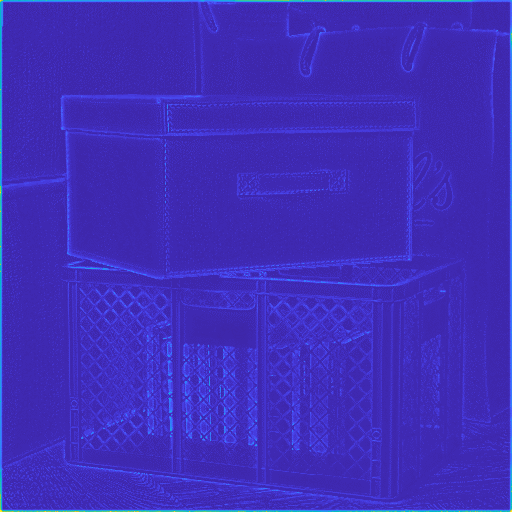
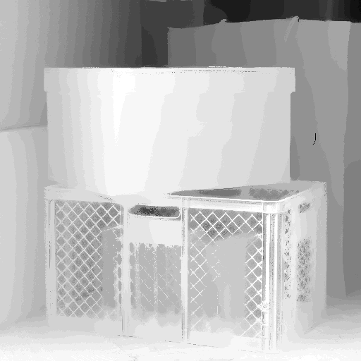

# Depth from Defocus

## 1. Introduction
### Goal
Get depth infromation from photos have different focal length

### Tasks
1. Image alignment (3pts) 
2. Initial depth from focus measure (6pts)
3. All in focus image (6pts)
4. Graph cuts and weighted median filter
    - Implementation apply of graph cut algorithm (9pts)
    - weighted median filter (1pt)
5. Add your own idea to improve the depth quality and describe it on your report

### Remark
- Dataset : Download in GEL (add later)
- Submit : Upload to GEL
    - Contain <u>source code</u> and <u>report</u>
    - File name : PA1_NAME_ID.zip
    - Due : PM 11:54:59 at 2020/10/30 (Friday)
    

## 2. Details

### Image alignment
- Alignment given images based on feature (feature-based alignment)
- Reference : https://sites.google.com/site/imagealignment/

* Remark : <b>should attach error map between each frames</b> 
### Initial Depth Estimation
- Initial depth estimation step (refine later)
- Use 2nd derivation of edges
    - convolve focus measure and observe activation
- Apply various focus measure(filters) to extract edges
    - Laplacian
    - Modified Laplacian(ML)
    - Sum of ML
    - Tenenbaum Focus Measure
- Step To make initial depth map
    1. convolve focus measure to each frames and stack frames(make 3D cost volume)
    2. take pixels have maximum response in each frames and make initial depth map 

### GraphCut Algorithm
- <b>Main task of PA1</b>
- Apply graphcut algorithm to cost volume made in previous step.
    - Do multi-label optimization
- Grouping different focus group
- Require two term
     - Data term : convert 3D->2D and apply algorithm
     - Smootheness term : apply intensity difference depth map(refinement)
- Doing depth refinement using Graph-cuts

### All-in Focus Image Stitiching
- Make image from depth map
- Stitiching pixels from each image which is corresponded with depth group in depth map

### Depth refinement
- Apply weighted median filter
    - grouping pixels by intensity
- Referencing “Constant time weighted median filtering for stereo matching and beyond”,
ICCV 2013, Z. Ma et al.
- Code : http://kaiminghe.com/  

## 3. Requirement

- MATLAB (I used MATLAB R2020b)
- Image Alignment Toolbox ([Link](https://sites.google.com/site/imagealignment/home))
- Multi-label optimization library(gco-v3.0, [Link](https://vision.cs.uwaterloo.ca/code/))
- Weighted Median Filter Toolbox ([Link](http://kaiminghe.com/))

## 4. Result

### (i) Final depth map

Left image is initial disparity map, and right one is final depth map. Final depth map is got from left disparity map, and I applied graph-cut and WMF(Weighted Median Filtering) for getting final depth map.

### (ii) All-in-Focus Image

I could get all-in-focus image using by above disparity/depth map. Left image is all-in-focus image, which obtained from initial disparity map, and right one is obtained from final depth map. I wrote detail method in my report.  Obviously, left image is more blurry than right image, because initial depth map is imperfect. 

